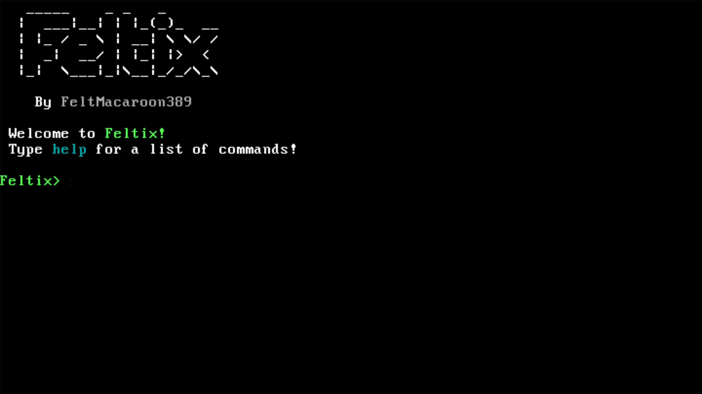

# Feltix

Feltix is an operating system written in C, with the primary focus on simplicity, modularity, and usablility.
Feltix is not intended for production use.

---

### Feltix currently supports the following hardware:
- i386 (x86) or AMD64 (x86_64) CPU
- Depending on the firmware, around 3 gigabytes of RAM
- BIOS firmware (not EFI/UEFI)
- Standard PS/2 and USB keyboards (US layout)
- 16-color 80*25 VGA text mode display
- Standard PC speaker/beeper

**MORE TO COME**

---

### Build instructions

- Install dependencies (see below).

- Clone the repository: `git clone https://github.com/FeltMacaroon389/Feltix.git`

- Build with: `make`

For a list of Make commands and targets, run: `make help`

The output image will be located in the `build` directory.

### Dependency installation

#### **Required**:

**Arch Linux**: 
- Run: `sudo pacman -Sy git nasm make`
- You will also require **GNU GCC** for the **i386** CPU architecture.

  - First, we need [i386-elf-binutils](https://aur.archlinux.org/packages/i386-elf-binutils)
    - Do: `git clone https://aur.archlinux.org/i386-elf-binutils.git`
    - Next, `cd i386-elf-binutils`
    - Finally, `makepkg -si`
    - You may be prompted for your password during this.

  - As for [i386-elf-gcc](https://aur.archlinux.org/packages/i386-elf-gcc)
    - Run: `git clone https://aur.archlinux.org/i386-elf-gcc.git`
    - Next, `cd i386-elf-gcc`
    - Finally, `makepkg -si`
    - You may be prompted for your password during this.

**Debian/Ubuntu**: 
- Run: `sudo apt update && sudo apt install git nasm make`
- You will also require **GNU GCC** for the **i386** CPU architecture. I suggest you follow [this guide](https://wiki.osdev.org/GCC_Cross-Compiler)

#### **Optional**:

**Arch Linux**: 
- Run: `sudo pacman -Sy qemu-full`

**Debian/Ubuntu**:
- Run: `sudo apt update && sudo apt install qemu`

## License
Feltix is licensed under the **GNU GPLv3** license. A copy of this license can be found at `LICENSE`